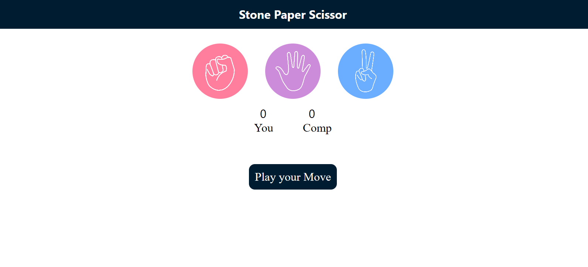

# 🪨📄✂️ Rock Paper Scissors Game

A simple **Rock Paper Scissors Game** built using HTML, CSS, and JavaScript. This interactive browser game lets users play against the computer and is a fun project to explore basic JavaScript logic and DOM manipulation.


---

## 🎮 Game Features

- Choose between Rock, Paper, or Scissors
- Computer randomly selects its move
- Score tracking for both user and computer
- Visual feedback with animations and result display

---

## 🛠️ Tech Stack

- HTML5
- CSS3
- JavaScript (Vanilla JS)

---

## 🚀 Getting Started

To run the project locally:

```bash
git clone https://github.com/vivekmengade/Rock-Paper-Scisssor-Game.git
cd Rock-Paper-Scisssor-Game
Then, simply open index.html in your browser!

📁 Project Structure
bash
Copy
Edit
Rock-Paper-Scisssor-Game/
│
├── index.html        # Main HTML file
├── style.css         # Styling file
└── script.js         # JavaScript logic
```
📷 Screenshots


✍️ Author
Vivek Mengade – @vivekmengade

📝 License
This project is licensed under the MIT License - see the LICENSE file for details.

🙌 Contributions
Pull requests are welcome! For major changes, please open an issue first to discuss what you'd like to change.

💡 Feedback
If you liked the game or have suggestions for improvement, feel free to raise an issue or contact me!
